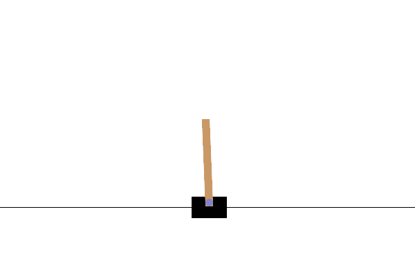

# CartPole PPO from Scratch

A from-scratch implementation of **Proximal Policy Optimization (PPO)** applied to `CartPole-v1`, written in pure NumPy — no PyTorch, no TensorFlow, no Stable-Baselines.

Every component was implemented by hand: the neural network, backpropagation, GAE-λ advantage estimation, the PPO clipped objective, and the Adam optimizer. The goal was to understand the impact of each design choice, rather than treating them as black-box primitives.



---

## Contents

| File                        | Description                                                   |
| --------------------------- | ------------------------------------------------------------- |
| `cartpole_ppo/agent.py`     | PPO agent — rollout, advantage computation, network updates   |
| `cartpole_ppo/network.py`   | Fully-connected neural network with manual backprop           |
| `cartpole_ppo/buffer.py`    | Rollout buffer                                                |
| `cartpole_ppo/optimizer.py` | Adam optimizer                                                |
| `cartpole_ppo/utils.py`     | Recording and plotting utilities                              |
| `scripts/train.py`          | Hyperparameter sweep script                                   |
| `CartPole_PPO.ipynb`        | Notebook with derivations, pseudocode and experiment analysis |

---

## Install

```bash
pip install git+https://github.com/GianS955/Gianluca-Simbula-Portfolio.git
```

Or clone and install locally:

```bash
git clone https://github.com/GianS955/Gianluca-Simbula-Portfolio.git
cd "Gianluca-Simbula-Portfolio/Reinforcement Learning/CartPole"
pip install -e .
```

---

## Quick start

```python
import gymnasium as gym
from cartpole_ppo import A2CAgent

env = gym.make("CartPole-v1")

actor_info = {
    "state_dimensions": env.observation_space.shape[0],
    "hidden_layer_dimensions": [64],
    "action_dimensions": env.action_space.n,
    "activation": "tanh",
}
critic_info = {
    "state_dimensions": env.observation_space.shape[0],
    "hidden_layer_dimensions": [64],
    "activation": "tanh",
}
agent_params = {
    "batch_size": 64,
    "rollout_steps": 2048,
    "update_epochs": 4,
    "clip_coefficient": 0.2,
    "entropy_coefficient": 0.01,
    "value_loss_coefficient": 0.5,
    "lambda": 0.95,
}
optimizer_params = {"learning_rate": 3e-4, "beta_1": 0.9, "beta_2": 0.999}
experiment_params = {"discount_factor": 0.99}

agent = A2CAgent(actor_info, critic_info, agent_params, optimizer_params, experiment_params)
```

To run the full hyperparameter sweep:

```bash
python scripts/train.py
```

---

## Implementation highlights

**Actor-Critic with separate networks** — the actor outputs logits over actions, the critic outputs a scalar state value. Two independent networks means two independent gradient flows, which simplifies the implementation and avoids interference between the policy and value gradients.

**Manual backpropagation** — gradients are derived and computed by hand. The gradient of the PPO clipped loss with respect to the logits is:

$$\frac{\partial \mathcal{L}^{\text{CLIP}}}{\partial z} = -\hat{A}_t \cdot r_t \cdot (\mathbf{e}_{a_t} - \boldsymbol{\pi})$$

zeroed out where the clip is active. Full derivations are in the notebook.

**GAE-λ advantage estimation** — computed via reverse accumulation in $O(T)$:

$$A_t = \delta_t + \gamma\lambda(1-d_t) \cdot A_{t+1}$$

**Adam optimizer** — implemented from scratch with bias correction for both moment estimates.

---

## Experiment results

Hyperparameter sweep over 7 parameters, each averaged across 5 random seeds.

| Parameter              | Values tested          | Impact                                         |
| ---------------------- | ---------------------- | ---------------------------------------------- |
| λ                      | 0.9 / **0.95** / 0.99  | High — most impactful parameter                |
| Learning rate          | 1e-4 / **3e-4** / 1e-3 | High — speed vs stability trade-off            |
| Rollout steps          | 512 / **2048** / 4096  | Medium — more steps, better estimates          |
| Update epochs          | 3 / **4** / 5          | Medium — more epochs, better sample efficiency |
| Entropy coefficient    | 0 / **0.01** / 0.05    | Low — affects entropy, not reward              |
| Clip coefficient       | 0.1 / **0.2** / 0.3    | None — clip never activates on CartPole        |
| Value loss coefficient | 0.1 / **0.5** / 1.0    | None — irrelevant with separate networks       |

Baseline values in **bold**. Full analysis with plots in the notebook.

The most notable finding: the PPO clip never activates on CartPole — policy updates are too small for the ratio $r_t$ to leave $[1-\varepsilon, 1+\varepsilon]$. This is not a bug but a property of the environment. A harder environment (e.g. LunarLander, MuJoCo) would tell a different story.

---

## Requirements

- Python ≥ 3.10
- numpy
- gymnasium
- matplotlib
- tqdm
- imageio

---

## Notebook

The [notebook](CartPole_PPO.ipynb) covers:

- Architecture design choices
- Step-by-step mathematical derivations (softmax, GAE-λ, PPO gradient, backprop, Adam)
- Full algorithm pseudocode
- Hyperparameter sweep analysis with plots

---

_Gianluca Simbula — [GitHub](https://github.com/GianS955)_
