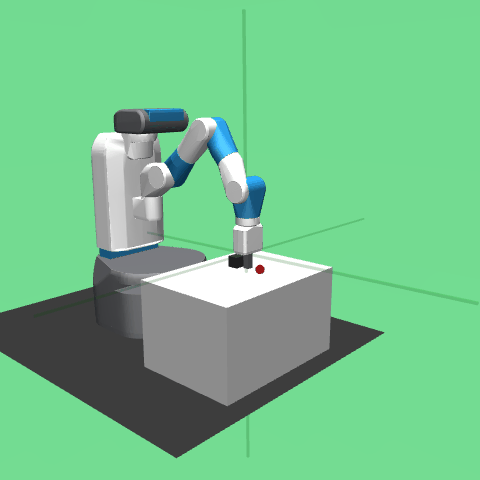
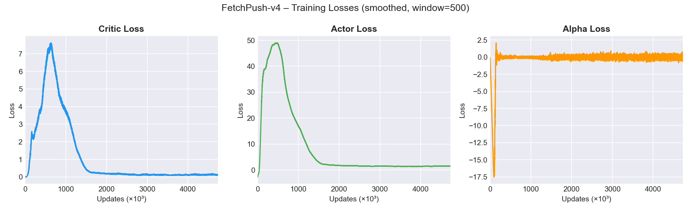

# FetchPush – SAC + HER from Scratch

Training a robotic arm to push an object to a target position using **Soft Actor-Critic (SAC)** with **Hindsight Experience Replay (HER)**, implemented from scratch in PyTorch on the [FetchPush-v4](https://robotics.farama.org/envs/fetch/push/) environment.

---

## Result

The agent achieves a **~95–100% success rate** after ~700 000 environment steps.



---

## Why SAC + HER?

FetchPush uses sparse rewards: `-1` at every step, `0` only when the object reaches the goal. The arm has to make contact with a rigid object and push it to a target position — a random policy almost never achieves this by chance, so a standard RL agent receives almost no positive signal and fails to learn.

**SAC** addresses exploration by maximising both reward and policy entropy:

$$J(\pi) = \sum_t \mathbb{E}\left[r_t + \alpha \mathcal{H}(\pi(\cdot | s_t))\right]$$

The entropy term keeps the policy stochastic, preventing premature convergence before the agent has found any useful behaviour.

**HER** turns every failed episode into a learning signal. For each transition $(s, a, r, s')$ with goal $g$, it generates $k$ relabelled transitions by substituting $g$ with goals actually reached later in the same episode (_future_ strategy) and recomputing the reward. This produces dense supervision from episodes that look like failures under the original goal.

### Design choices

Layer normalisation after each hidden layer was critical — without it the critic loss oscillated heavily and the Q-values drifted outside the theoretically valid range. Gradient clipping (max norm 1.0) on both actor and critic was necessary to keep training stable at scale.

---

## Architecture

```
FetchPush/
├── network.py          # Actor, Critic, TwinCritic
├── replay_buffer.py    # Goal-conditioned circular replay buffer + ImprovementBuffer
├── sac_agent.py        # SAC update logic (critic, actor, alpha, soft update)
├── train.py            # Training loop with HER, early stopping, TensorBoard
├── visualize.py        # Generate GIF from trained model
└── results/            # Checkpoints, CSVs, TensorBoard logs, plots
```

**Networks:**

- **Actor** – Gaussian policy, reparameterisation trick, tanh squashing, 3 × 256 + LayerNorm
- **TwinCritic** – Two independent Q-networks with clipped double Q-learning, 3 × 256 + LayerNorm
- **Temperature α** – Learned automatically, target entropy = −action_dim = −4

**HER (future strategy):**
For each episode of length $T$, sample $k = 4$ future steps $t' > t$, substitute $g \leftarrow \text{ag}_{t'}$, recompute reward, and store in the replay buffer.

---

## Setup

```bash
python -m venv env
env\Scripts\activate       # Windows
pip install -r requirements.txt
```

---

## Training

```bash
python train.py
```

To resume a previous run:

```python
from train import train
train(result_folder='results/<run_folder>')
```

Key hyperparameters:

| Parameter     | Value               |
| ------------- | ------------------- |
| Hidden layers | 3 × 256 + LayerNorm |
| Batch size    | 1 024               |
| Replay buffer | 1 000 000           |
| Learning rate | 3e-5                |
| Discount γ    | 0.99                |
| Soft update τ | 0.001               |
| HER ratio k   | 4                   |

Early stopping triggers when the mean success rate over the last 20 evaluations stays within 5% of the best recorded value for 40 consecutive evaluations (every 5 000 steps).

---

## Results

| Metric             | Value                                            |
| ------------------ | ------------------------------------------------ |
| Convergence        | ~700 000 steps                                   |
| Final success rate | ~95–100% (50-episode eval, deterministic policy) |




---

## References

- Haarnoja et al. (2018) – [Soft Actor-Critic](https://arxiv.org/abs/1801.01290)
- Andrychowicz et al. (2017) – [Hindsight Experience Replay](https://arxiv.org/abs/1707.01495)
- [Spinning Up in Deep RL – SAC](https://spinningup.openai.com/en/latest/algorithms/sac.html)
