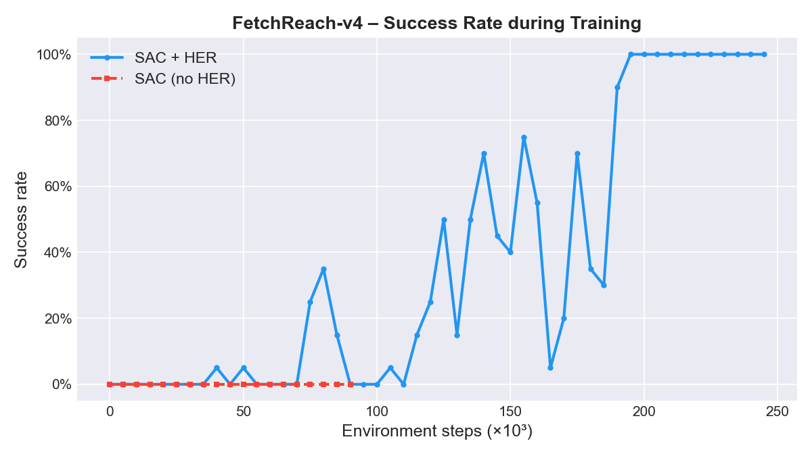
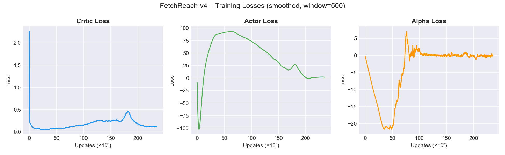

# FetchReach – SAC + HER from Scratch

Training a robotic arm to reach a target position using **Soft Actor-Critic (SAC)** with **Hindsight Experience Replay (HER)**, implemented from scratch in PyTorch on the [FetchReach-v4](https://robotics.farama.org/envs/fetch/reach/) environment.

---

## Result

The agent achieves a **100% success rate** after ~200,000 environment steps (~4,000 episodes).


---

## Why SAC + HER?

**FetchReach** uses sparse rewards: `-1` at every step, `0` only when the goal is reached. A standard RL agent almost never encounters a positive reward by chance, making learning extremely slow.

**SAC** (Haarnoja et al., 2018) addresses exploration by maximising both reward and policy entropy:

$$J(\pi) = \sum_t \mathbb{E}\left[r_t + \alpha \mathcal{H}(\pi(\cdot | s_t))\right]$$

The entropy term $\mathcal{H}(\pi)$ incentivises the policy to remain stochastic — if two actions yield similar Q-values, SAC deliberately spreads probability mass across both rather than committing to one. This prevents premature convergence to suboptimal deterministic behaviours, which is critical in sparse-reward environments where the agent must keep exploring.

The key update equations are:

| Component   | Loss                                                                                                                                                                           |
| ----------- | ------------------------------------------------------------------------------------------------------------------------------------------------------------------------------ |
| Critic      | $\mathcal{L}(Q) = \mathbb{E}\left[(Q(s,a) - y)^2\right]$, &nbsp; $y = r + \gamma(1-d)\left[\min_{j}Q_{\text{target},j}(s',\tilde{a}') - \alpha \log\pi(\tilde{a}'\|s')\right]$ |
| Actor       | $\mathcal{L}(\pi) = \mathbb{E}\left[\alpha \log\pi(\tilde{a}\|s) - \min_j Q_j(s,\tilde{a})\right]$                                                                             |
| Temperature | $\mathcal{L}(\alpha) = \mathbb{E}\left[-\alpha(\log\pi(\tilde{a}\|s) + \mathcal{H}_{\text{target}})\right]$                                                                    |

### Reparameterisation trick

The actor outputs a Gaussian distribution $\pi(\cdot|s) = \mathcal{N}(\mu_\phi(s),\, \sigma_\phi(s))$ from which actions are sampled. Sampling is not differentiable, so gradients cannot flow back to the network parameters through a naive `sample()` call. The reparameterisation trick rewrites sampling as a deterministic transformation:

$$\tilde{a} = \mu_\phi(s) + \sigma_\phi(s) \cdot \varepsilon, \qquad \varepsilon \sim \mathcal{N}(0, I)$$

$\varepsilon$ is sampled once and treated as a constant; the computation graph only passes through $\mu_\phi$ and $\sigma_\phi$, making the operation fully differentiable. A final $\tanh$ squashes actions into $[-1, 1]$, with the log-probability corrected for this transformation via the change-of-variables formula.

### Twin Critic and clipped double Q-learning

A single Q-network tends to overestimate action values, because the Bellman target takes a max over noisy Q-estimates. This overestimation compounds over updates, destabilising training. SAC uses **two independent critics** $Q_1$ and $Q_2$ and computes the target using their minimum:

$$y = r + \gamma(1-d)\left[\min(Q_1, Q_2)(s', \tilde{a}') - \alpha \log\pi(\tilde{a}'|s')\right]$$

Since the two networks overestimate independently, taking the minimum consistently selects the more conservative — and more accurate — estimate.

### Target network and soft update

Using the same Q-network to both predict and compute targets creates a moving-target problem: the network chases its own output, leading to oscillations or divergence. A **frozen copy** (target network) provides stable targets. Rather than hard-copying the online weights periodically, SAC applies a soft update at every step:

$$\theta_{\text{target}} \leftarrow \tau\,\theta_{\text{online}} + (1-\tau)\,\theta_{\text{target}}$$

With $\tau = 0.05$, the target moves only 5% towards the online network per step, keeping targets stable while slowly tracking improvements.

**HER** (Andrychowicz et al., 2017) turns failed episodes into useful training signal. For each transition $(s, a, r, s')$ with goal $g$, it creates additional transitions by substituting $g$ with goals actually achieved later in the same episode (_future_ strategy), recomputing the reward accordingly. This produces abundant positive examples without any extra environment interaction.

---

## Architecture

```
FetchReach/
├── network.py          # Actor, Critic, TwinCritic
├── replay_buffer.py    # Goal-conditioned circular replay buffer
├── sac_agent.py        # SAC update logic (critic, actor, alpha, soft update)
├── train.py            # Training loop with HER, early stopping, TensorBoard
├── visualize.py        # Generate GIF from trained model
├── requirements.txt
└── results/            # Checkpoints, CSVs, TensorBoard logs, plots
```

**Networks:**

- **Actor** – Gaussian policy with reparameterisation trick and tanh squashing
- **TwinCritic** – Two independent Q-networks (clipped double Q-learning)
- **Temperature α** – Learned automatically via dual gradient descent

**HER (future strategy):**  
For each episode of length $T$, for each step $t$, sample $k=4$ future achieved goals $g' = \text{ag}_{t'}$ with $t' > t$, substitute $g \leftarrow g'$, recompute reward, and store in the replay buffer.

---

## Setup

```bash
# Create and activate environment
conda create -n fetchreach python=3.11
conda activate fetchreach

# Install dependencies
pip install torch gymnasium gymnasium-robotics imageio tqdm tensorboard
```

---

## Training

```bash
python train.py
```

Key hyperparameters (in `train.py`):

| Parameter               | Value          |
| ----------------------- | -------------- |
| Hidden layers           | 3 × 64         |
| Batch size              | 256            |
| Replay buffer           | 100 000        |
| Learning rate           | 1e-4           |
| Discount γ              | 0.99           |
| Soft update τ           | 0.05           |
| HER ratio k             | 4              |
| Early stopping patience | 10 evaluations |

Training stops automatically when success rate does not improve for 10 consecutive evaluations (every 5 000 steps).

---

## Visualisation

```bash
python visualize.py "results/<run_folder>"
```

Generates `fetchreach.gif` with 5 episodes of the trained agent.

---

## Results

| Metric             | Value                            |
| ------------------ | -------------------------------- |
| Convergence        | ~200 000 steps (~4 000 episodes) |
| Final success rate | 100% (20-episode eval)           |

### Success Rate

The chart below compares SAC+HER against a SAC baseline trained without HER. Without HER the agent never encounters a positive reward and fails to learn entirely; with HER it reaches 100% success rate in ~200 000 steps.



### Training Losses



The critic loss decreases as Q-value estimates converge. The actor loss trends downward as the policy improves (more negative = higher expected Q minus entropy cost). The alpha loss oscillates around zero as the entropy coefficient adapts to keep policy entropy close to the target.

---

## References

- Haarnoja et al. (2018) – [Soft Actor-Critic](https://arxiv.org/abs/1801.01290)
- Andrychowicz et al. (2017) – [Hindsight Experience Replay](https://arxiv.org/abs/1707.01495)
- [Spinning Up in Deep RL – SAC](https://spinningup.openai.com/en/latest/algorithms/sac.html)
