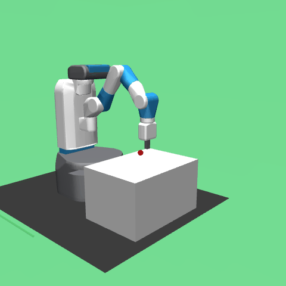
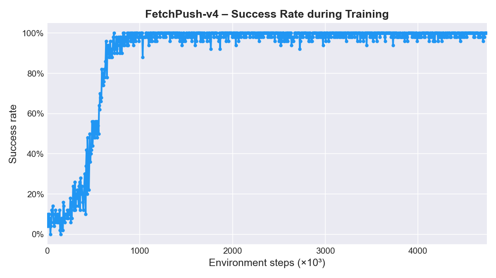

# SAC + HER — Robotic Manipulation from Scratch

Implementation of **Soft Actor-Critic (SAC)** with **Hindsight Experience Replay (HER)** in PyTorch, applied to two robotic manipulation tasks of increasing difficulty from the [Farama Gymnasium Robotics](https://robotics.farama.org/) suite.

The trained FetchPush agent is deployed as a ROS2 action server in the [fetchpush-ros2](#) repository.

---

## Results

| Environment | Task | Steps to convergence | Success rate |
|---|---|---|---|
| [FetchReach-v4](https://robotics.farama.org/envs/fetch/reach/) | Move end-effector to target position | ~200 000 | 100% |
| [FetchPush-v4](https://robotics.farama.org/envs/fetch/push/) | Push object to target position | ~700 000 | ~95–100% |

FetchReach is solved in roughly a third of the steps — the arm only needs to move to a point in space. FetchPush requires making contact with a rigid object and maintaining control of it, which is harder to explore and demands a larger network with stabilisation techniques.

---

## Why SAC + HER?

Both environments use **sparse rewards**: `-1` at every step, `0` only on success. A random policy almost never reaches a positive reward by chance — standard RL agents fail entirely in this setting.

**SAC** (Haarnoja et al., 2018) keeps the policy stochastic by maximising both reward and entropy:

$$J(\pi) = \sum_t \mathbb{E}\left[r_t + \alpha \mathcal{H}(\pi(\cdot | s_t))\right]$$

This prevents premature convergence before the agent has found any useful behaviour.

**HER** (Andrychowicz et al., 2017) turns failed episodes into learning signal. For each transition $(s, a, r, s')$ with goal $g$, it creates $k$ relabelled transitions by substituting $g$ with goals actually reached later in the same episode (_future_ strategy) and recomputing the reward. This produces dense supervision without any extra environment interaction.

---

## Architecture

Both implementations share the same structure:

```
FetchReach/   (or FetchPush/)
├── network.py          # Actor, TwinCritic
├── replay_buffer.py    # Goal-conditioned circular replay buffer
├── sac_agent.py        # SAC update logic (critic, actor, alpha, soft update)
├── train.py            # Training loop with HER and early stopping
├── test.py             # Evaluate a trained policy
└── results/            # Checkpoints, logs, plots
```

**Actor** — Gaussian policy with reparameterisation trick and tanh squashing. Actions are sampled as $\tilde{a} = \mu_\phi(s) + \sigma_\phi(s) \cdot \varepsilon$, $\varepsilon \sim \mathcal{N}(0, I)$, keeping the computation graph differentiable through $\mu_\phi$ and $\sigma_\phi$.

**TwinCritic** — Two independent Q-networks. The Bellman target uses their minimum to counteract overestimation bias:
$$y = r + \gamma(1-d)\left[\min(Q_1, Q_2)(s', \tilde{a}') - \alpha \log\pi(\tilde{a}'|s')\right]$$

**Temperature α** — Learned automatically via dual gradient descent with target entropy $\mathcal{H}_{\text{target}} = -|\mathcal{A}|$.

**Soft update** — Target networks are updated every step with $\theta_{\text{target}} \leftarrow \tau\,\theta_{\text{online}} + (1-\tau)\,\theta_{\text{target}}$.

### Key differences between FetchReach and FetchPush

FetchPush required two additional stabilisation measures that were unnecessary for the simpler task:

- **Layer normalisation** after each hidden layer — without it, Q-values drifted outside the theoretically valid range and the critic loss oscillated heavily.
- **Gradient clipping** (max norm 1.0) on both actor and critic — necessary to keep training stable at the larger scale (~700k steps, batch size 1024).

| | FetchReach | FetchPush |
|---|---|---|
| Hidden layers | 3 × 64 | 3 × 256 + LayerNorm |
| Batch size | 256 | 1 024 |
| Replay buffer | 100 000 | 1 000 000 |
| Learning rate | 1e-4 | 3e-5 |
| Soft update τ | 0.05 | 0.001 |

---

## Setup

**FetchReach:**
```bash
conda create -n fetchreach python=3.11
conda activate fetchreach
pip install torch gymnasium gymnasium-robotics imageio tqdm tensorboard
```

**FetchPush:**
```bash
python -m venv env
env\Scripts\activate    # Windows
pip install -r requirements.txt
```

---

## Training

```bash
cd FetchReach   # or FetchPush
python train.py
```

To resume a FetchPush run:
```python
from train import train
train(result_folder='results/<run_folder>')
```

---

## FetchReach results

The agent reaches **100% success rate** in ~200 000 steps (~4 000 episodes).



The chart below compares SAC+HER against a SAC baseline without HER. Without HER the agent never encounters a positive reward and fails to learn entirely.


---

## FetchPush results

The agent reaches **~95–100% success rate** in ~700 000 steps.




---

## References

- Haarnoja et al. (2018) – [Soft Actor-Critic](https://arxiv.org/abs/1801.01290)
- Andrychowicz et al. (2017) – [Hindsight Experience Replay](https://arxiv.org/abs/1707.01495)
- [Spinning Up in Deep RL – SAC](https://spinningup.openai.com/en/latest/algorithms/sac.html)
